# 多媒体综合信息发布系统

#### 介绍
企业级信息发布系统后台，采用java语言开发，组件丰富支持图片、视频轮播、滚动字幕、日期时间，支持设备管理，设备监控，远程控制，定时即时发布节目，终端适配android和windows。

#### 开源说明
当前版本功能暂时不开源（有需要找我）
- 开源地址：https://gitee.com/rominsoft/codeless-desktop-system

#### 问题背景
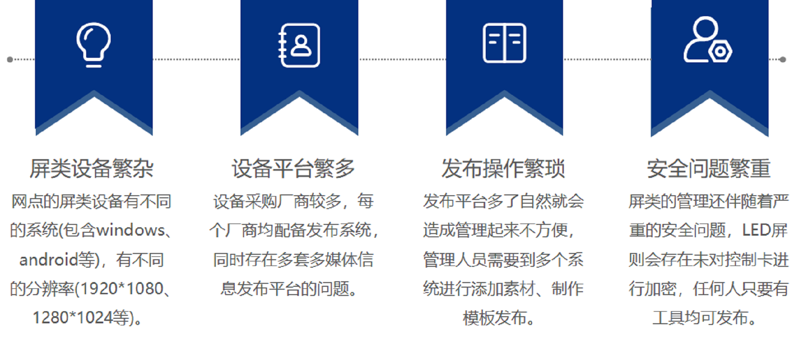

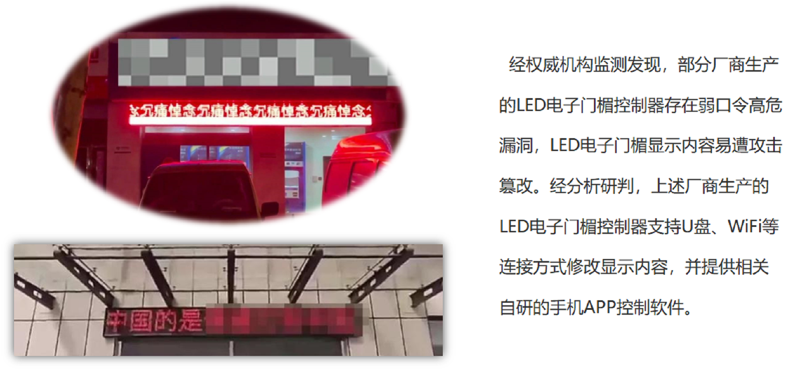

#### 软件架构
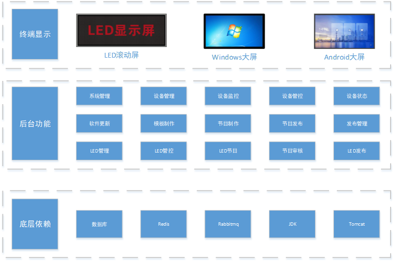

#### 操作视频
https://www.bilibili.com/video/BV1mV4y1f7Jq/?vd_source=d11869e13dfa6389fd0796de69d9899f

#### 体验地址
* 地址：http://110.42.234.26:8090/ims/
* 用户密码: admin/admin123

#### 演示视频
https://www.bilibili.com/video/BV1Hu4y1U7MD/?vd_source=d11869e13dfa6389fd0796de69d9899f

#### 系统功能
1产品化软件功能-系统平台

  1.1  系统管理

    1.1.1    用户管理 用户信息维护

    1.1.2    角色管理 角色信息维护

    1.1.3    菜单管理 菜单信息维护

    1.1.4    部门管理 部门信息管理

    1.1.5    岗位管理 岗位信息维护

    1.1.6    字典管理 字典信息维护

    1.1.7    参数管理 参数维护

    1.1.8    日志管理 日志查看

    1.1.9    软件更新 终端APP软件更新，包含指定发布和全部发布

  1.2  系统监控

    1.2.1    在线用户 在线用户列表

    1.2.2    文件信息 本地文件信息查看

    1.2.3    定时任务 定时任务

    1.2.4    数据监控 数据库监控

    1.2.5    服务监控 平台服务监控

  1.3  设备管理

    1.3.1    设备管控 远程控制设备关机、重启等操作

    1.3.2    设备信息 设备信息维护

    1.3.3    设备监控 监控终端设备固件信息，包括当前节目信息

    1.3.4    设备状态 设备状态变化

  1.4  信息发布

    1.4.1    素材管理 上传维护文件素材信息

    1.4.2    模板管理 绘制节目模板，可视化操作，通过拖拽的方式

    1.4.3    节目管理 维护管理节目，所见即所得的节目编辑

    1.4.4    快捷制作 支持视频和图片轮播、滚动字幕、日期控件

    1.4.5    发布管理 信息发布记录，包括节目发布后的状态

    1.4.6    设备节目 查看设备对应最新的设备节目
    
  1.5  LED管理

    1.5.1    显示屏信息 维护跑马屏基本信息，通过IP寻找，设置加密密码，杜绝舆情风险

    1.5.2    节目列表 维护发送节目内容，支持审批模式

    1.5.3    显示屏节目 可分别查看显示屏当前所有的节目列表

    1.5.4    发布记录 信息发布记录，包括节目发布后的状态

2产品化软件功能-终端软件

  2.1  android信息发布软件

    2.1.1    支持任务布局展示

    2.1.2    支持视频、图片及文字轮播

    2.1.3    支持在线监控

    2.1.4    支持控制关机、重启

    2.1.5    自动开关机工具

    2.1.6    远程工具安装android端的VNC服务

  2.2  Windows信息发布软件

    2.2.1    支持视频、图片及文字轮播

    2.2.2    支持在线监控

    2.2.3    支持控制关机、重启

#### 页面示例
##### 信息发布
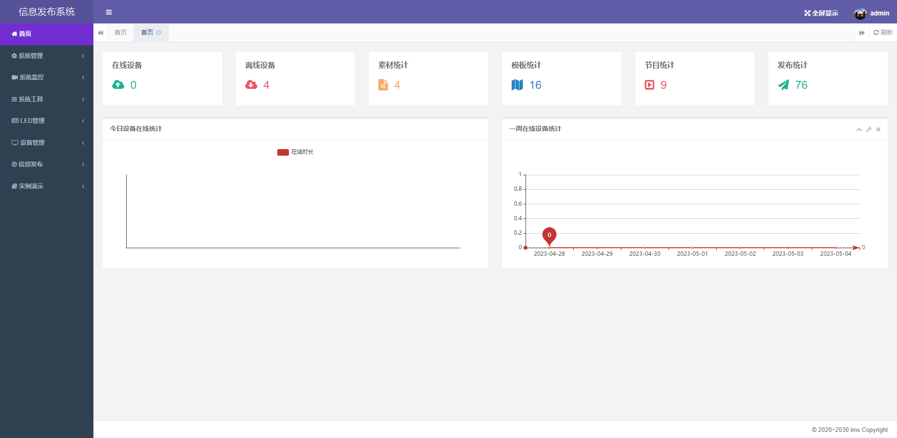
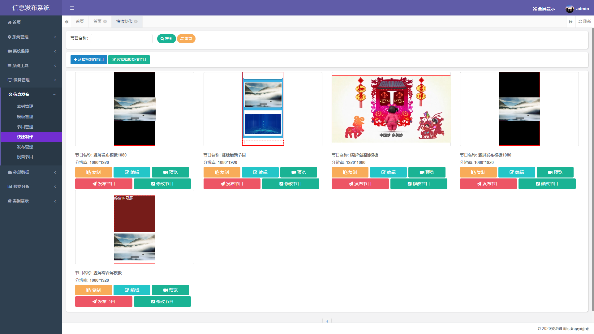
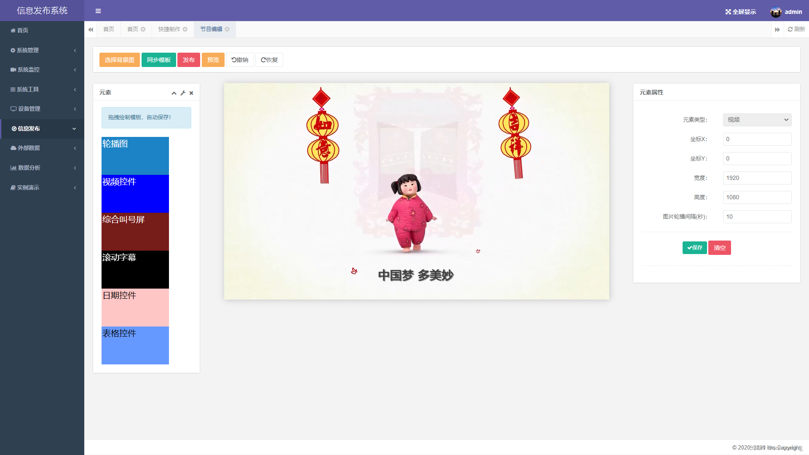
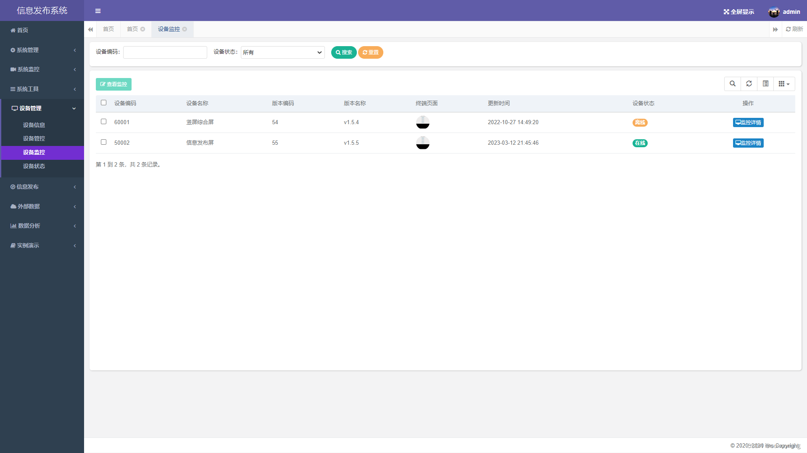
##### 跑马屏发布
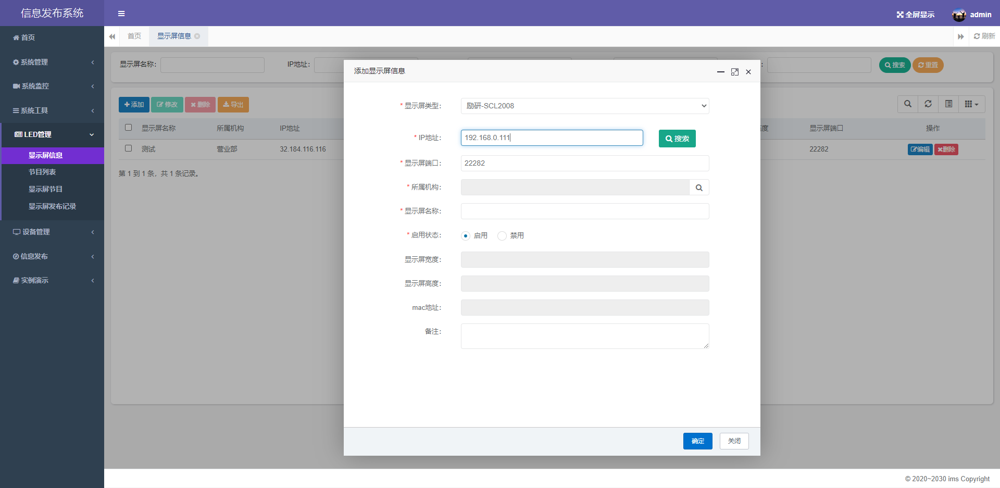
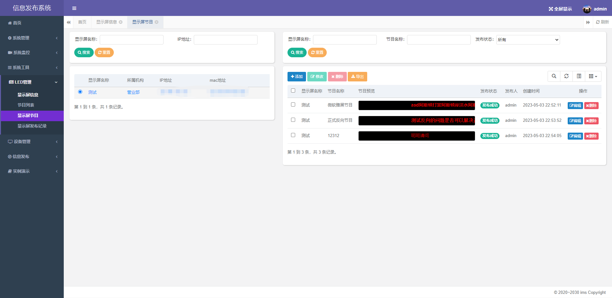
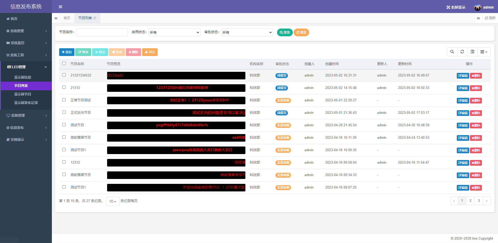
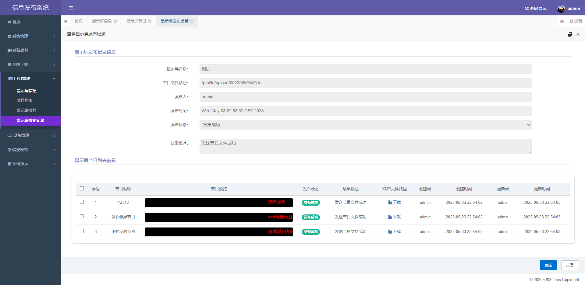

#### 参与贡献

1.  Fork 本仓库
2.  新建 Feat_xxx 分支
3.  提交代码
4.  新建 Pull Request

#### 特技

1.  使用 Readme\_XXX.md 来支持不同的语言，例如 Readme\_en.md, Readme\_zh.md
2.  Gitee 官方博客 [blog.gitee.com](https://blog.gitee.com)
3.  你可以 [https://gitee.com/explore](https://gitee.com/explore) 这个地址来了解 Gitee 上的优秀开源项目
4.  [GVP](https://gitee.com/gvp) 全称是 Gitee 最有价值开源项目，是综合评定出的优秀开源项目
5.  Gitee 官方提供的使用手册 [https://gitee.com/help](https://gitee.com/help)
6.  Gitee 封面人物是一档用来展示 Gitee 会员风采的栏目 [https://gitee.com/gitee-stars/](https://gitee.com/gitee-stars/)
